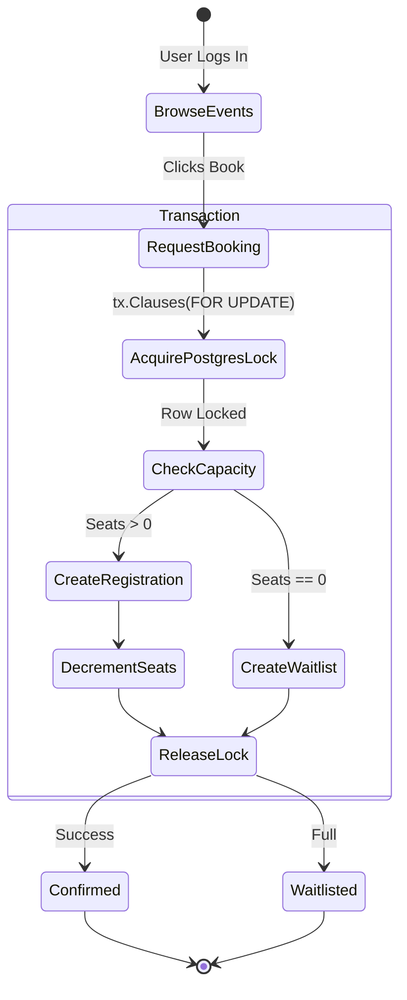

# Event Registration & Ticketing System 🎟️

A robust REST API backend built for proving that high-concurrency ticket booking can be managed atomically safely without race conditions.

This project was built using Go (Golang), Gin Web Framework, and PostgreSQL. It features a fully integrated Vanilla JS/CSS frontend served out-of-the-box from the same binary.

---

## 🎯 Problem Statement
In high-demand event ticketing systems (like Eventbrite, Ticketmaster), thousands of users might attempt to buy the last 10 remaining seats at the exact same millisecond. If the backend simply reads the database, sees 10 seats, subtracts 1, and saves it, **Race Conditions** occur. Multiple threads read the *same* `10` value simultaneously, resulting in 100 people successfully booking a ticket when only 10 existed. 

This leads to catastrophic overbooking and data corruption.

## ✨ Features
*   **Role-Based Access Control (RBAC):** `AUDIENCE`, `ORGANIZER`, and `ADMIN` roles enforced securely via JWT Middleware.
*   **Event Management:** Organizers can draft, publish, and track capacity analytics for their events.
*   **Transactional Booking:** Users can browse published events and book seats safely.
*   **Automatic Waitlisting:** If an event hits 0 capacity, subsequent users are correctly shunted to a positional Waitlist.
*   **Atomic Concurrency Control:** Implements PostgreSQL **Pessimistic Locking** (`SELECT FOR UPDATE`) to eliminate race conditions.
*   **Integrated Frontend UI:** A gorgeous glassmorphism UI built with zero external framework dependencies, served natively by the Go router.

---

## 🔒 The Concurrency Strategy: Pessimistic Row-Level Locking
To prevent the catastrophic overbooking problem entirely, this system relies on PostgreSQL's explicit locking clauses. 

Instead of Optimistic Locking (which relies on a `version` column and fails/retries transactions continuously, wasting CPU), we employ **Pessimistic Locking**.

### How it Works (Inside `RegistrationService.BookEvent`):
```go
err := s.db.Transaction(func(tx *gorm.DB) error {
    // 1. Lock the specific EVENT row exclusively for this transaction
    var event models.Event
    tx.Clauses(clause.Locking{Strength: "UPDATE"}).Where("id = ?", eventID).First(&event)

    // 2. The row is locked! Check capacity.
    if event.SeatsRemaining > 0 {
        // Book seat
        event.SeatsRemaining -= 1
        tx.Save(&event) // Commit changes
    } else {
        // Add to Waitlist
    }
    return nil // 3. The transaction Ends, and the Lock is Released for the next thread!
})
```
By explicitly pushing the concurrency management *down into the database engine itself*, the Go application guarantees isolated atomicity regardless of how many horizontal scaling application pods are spun up. 

### ⚡ The Simulation Endpoint
To prove this works, an **Admin Stress Test** endpoint is provided at `POST /admin/events/:id/simulate?users=N`.
This endpoint dynamically constructs `N` unique dummy users, and then fires `N` simultaneous GoRoutines that purposefully hammer the `BookEvent` function synchronously. 

**Result**: Even if 1000 users hit a 10-seat event simultaneously, exactly 10 will succeed, 990 will be waitlisted, and `seats_remaining` will perfectly rest at 0.

---

## 📊 State Machine Diagram (Ticketing Flow)



---

## 📁 Document Structure
```text
/cmd/api/         -> main.go (Application Entrypoint)
/internal/        
    /config/      -> Environment variable loading 
    /db/          -> PostgreSQL Connection & Seeder Logic
    /models/      -> GORM Database Schemas
    /repositories/-> Data Access Layer
    /services/    -> Core Business Logic (Where Locks live)
    /handlers/    -> Gin HTTP Controllers
    /middleware/  -> JWT Authentication & RBAC Checkers
    /router/      -> API Route Definitions
/static/          -> Vanilla Frontend Code (index.html, styles.css, app.js)
```

---

## 🚀 Setup & Execution Guide (Windows/PowerShell)

### Prerequisites:
1. **Golang** (v1.20+)
2. **PostgreSQL** Server running locally on port 5432.

### Step-by-Step Instructions:

**1. Create the Database**
Open `psql` or pgAdmin, and create the empty database:
```sql
CREATE DATABASE event_registration;
```

**2. Configure Environment Variables**
A `.env` file should be present in your root directory. Ensure your PostgreSQL password is correct:
```env
DB_HOST=127.0.0.1
DB_PORT=5432
DB_USER=postgres
DB_PASSWORD=your_super_secret_password
DB_NAME=event_registration
JWT_SECRET=super_secret_jwt_key
PORT=8080
```

**3. Run the Server**
The backend includes an automatic **Seeder** that will inject sample events and users into your database upon the first boot.
```powershell
go run ./cmd/api
```

**4. Access the Platform**
Open your favorite web browser and navigate to:
👉 **[http://localhost:8080](http://localhost:8080)**

**5. Test the Concurrency Simulation (Grading Demo)**
1. Log in with the pre-seeded Admin credentials:
   - Email: `admin@eventbrite.local`
   - Password: `admin123`
2. Scroll to the "Golang Microservices Summit" event (10 Seats).
3. Click the red **"⚡ Run Concurrency Sim"** button.
4. Enter 100 users, click Launch, and witness the goroutines battle perfectly in real-time!
